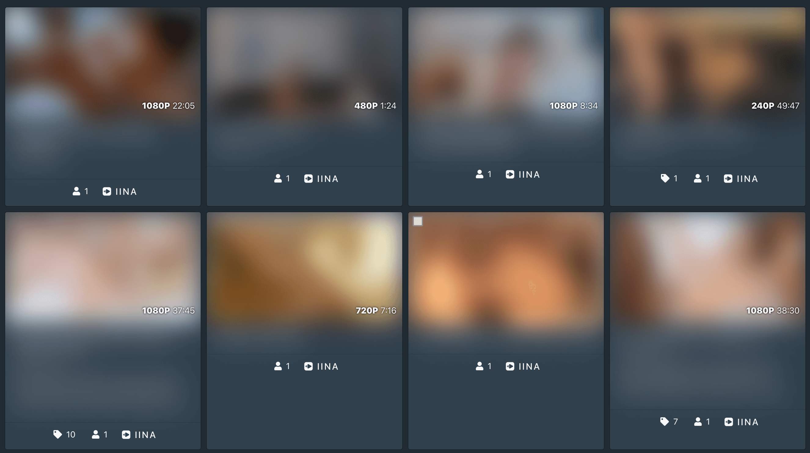

# Open scene in IINA

Adds a button to open scene in [IINA](https://iina.io/) media player



## Installation

Copy [custom.js](https://raw.githubusercontent.com/stashapp/CommunityScripts/main/custom_javascript/open_scene_in_iina/custom.js) and paste in Settings → Interface → Custom Javascript → Edit

File will be saved as custom.js in your stash configuration

[https://github.com/stashapp/stash/pull/3132](https://github.com/stashapp/stash/pull/3132)

## Settings

| Key | Description |
| - | - |
| `apiKey` | Needed to get file path from scene ID. Generate in Settings → Security |
| `urlScheme` | Protocol to open media player. Only tested with IINA on macOS |
| `replacePath` | Replace docker container path with local path. Default `["", ""]` |

## Example

```js
const settings = {
  "apiKey": "eKoCbZSSyo",
  "urlScheme": "iina://weblink?url=file://",
  "replacePath": ["/data/", "/Volumes/folder/"],
};
```

## Notes

Stop Chrome from asking permission to open IINA every time

```bash
defaults write com.google.Chrome URLAllowlist -array-add "iina://*"
```
