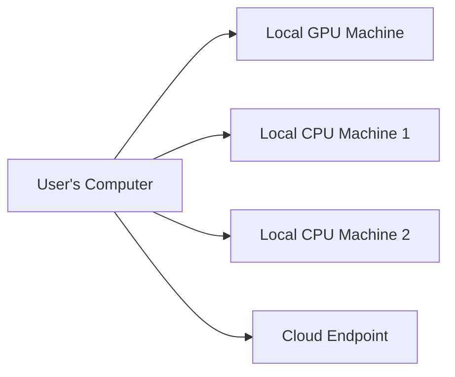

# A Haven VLM Connector

https://discourse.stashapp.cc/t/haven-vlm-connector/5464

A StashApp plugin for Vision-Language Model (VLM) based content tagging and analysis. This plugin is designed with a **local-first philosophy**, empowering users to run analysis on their own hardware (using CPU or GPU) and their local network. It also supports cloud-based VLM endpoints for additional flexibility. The Haven VLM Engine provides advanced automatic content detection and tagging, delivering superior accuracy compared to traditional image classification methods.

## Features

- **Local Network Empowerment**: Distribute processing across home/office computers without cloud dependencies
- **Context-Aware Detection**: Leverages Vision-Language Models' understanding of visual relationships
- **Advanced Dependency Management**: Uses PythonDepManager for automatic dependency installation
- **Enjoying Funscript Haven?** Check out more tools and projects at https://github.com/Haven-hvn

## Requirements

- Python 3.8+
- StashApp
- PythonDepManager plugin (automatically handles dependencies)
- OpenAI-compatible VLM endpoints (local or cloud-based)

## Installation

1. Clone or download this plugin to your StashApp plugins directory
2. Ensure PythonDepManager is installed in your StashApp plugins
3. Configure your VLM endpoints in `haven_vlm_config.py` (local network endpoints recommended)
4. Restart StashApp

The plugin automatically manages all dependencies.

## Why Local-First?

- **Complete Control**: Process sensitive content on your own hardware
- **Cost Effective**: Avoid cloud processing fees by using existing resources
- **Flexible Scaling**: Add more computers to your local network for increased capacity
- **Privacy Focused**: Keep your media completely private
- **Hybrid Options**: Combine local and cloud endpoints for optimal flexibility



## Configuration

### Easy Setup with LM Studio

[LM Studio](https://lmstudio.ai/) provides the easiest way to configure local endpoints:

1. Download and install [LM Studio](https://lmstudio.ai/)
2. [Search for or download](https://huggingface.co/models) a vision-capable model; tested with : (in order of high to low accuracy) zai-org/glm-4.6v-flash, huihui-mistral-small-3.2-24b-instruct-2506-abliterated-v2, qwen/qwen3-vl-8b, lfm2.5-vl
3. Load your desired Model
4. On the developer tab start the local server using the start toggle
5. Optionally click the Settings gear then toggle *Serve on local network*
5. Optionally configure `haven_vlm_config.py`:

By default locahost is included in the config, **remove cloud endpoint if you don't want automatic failover**
```python
{
    "base_url": "http://localhost:1234/v1",  # LM Studio default
    "api_key": "",                          # API key not required
    "name": "lm-studio-local",
    "weight": 5,
    "is_fallback": False
}
```

### Tag Configuration

```python
"tag_list": [
    "Basketball point", "Foul", "Break-away", "Turnover"
]
```

### Processing Settings

```python
VIDEO_FRAME_INTERVAL = 2.0  # Process every 2 seconds
CONCURRENT_TASK_LIMIT = 8   # Adjust based on local hardware
```

## Usage

### Tag Videos
1. Tag scenes with `VLM_TagMe`
2. Run "Tag Videos" task
3. Plugin processes content using local/network resources

### Performance Tips
- Start with 2-3 local machines for load balancing
- Assign higher weights to GPU-enabled machines
- Adjust `CONCURRENT_TASK_LIMIT` based on total system resources
- Use SSD storage for better I/O performance

## File Structure

```
AHavenVLMConnector/
├── ahavenvlmconnector.yml
├── haven_vlm_connector.py
├── haven_vlm_config.py
├── haven_vlm_engine.py
├── haven_media_handler.py
├── haven_vlm_utility.py
├── requirements.txt
└── README.md
```

## Troubleshooting

### Local Network Setup
- Ensure firewalls allow communication between machines
- Verify all local endpoints are running VLM services
- Use static IPs for local machines
- Check `http://local-machine-ip:port/v1` responds correctly

### Performance Optimization
- **Distribute Load**: Use multiple mid-range machines instead of one high-end
- **GPU Prioritization**: Assign highest weight to GPU machines
- **Network Speed**: Use wired Ethernet connections for faster transfer
- **Resource Monitoring**: Watch system resources during processing

## Development

### Adding Local Endpoints
1. Install VLM service on network machines
2. Add endpoint configuration with local IPs
3. Set appropriate weights based on hardware capability

### Custom Models
Use any OpenAI-compatible models that support:
- POST requests to `/v1/chat/completions`
- Vision capabilities with image input
- Local deployment options

### Log Messages

Check StashApp logs for detailed processing information and error messages.

## License

This project is part of the StashApp Community Scripts collection.