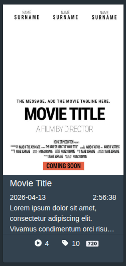
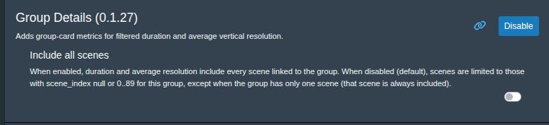

# Group Details

`Group Details` is a UI plugin for Stash group card.

## Screenshot



## What It Adds

- **Date line:** appends total duration (`H:MM:SS`) to the right side of the date row.
- **Chip list:** appends a resolution chip (PNG badge) to the end of `.card-popovers`.
- **Performer chip (optional):** when enabled, appends a performer-count chip with a hover popover.
- **Tooltips/popovers:** duration and resolution expose native `title` tooltips; performer chip opens a delayed hover popover.

## Data Source

Metrics are computed in-browser from GraphQL `findGroup` scene data (`id`, `title`, `files { duration height }`, `performers { id name image_path }`, `groups { group { id } scene_index }`).

## Scene Filtering

When **Include all scenes** is disabled (default), scenes are included only if `scene_index` is:

- `null`, or
- an integer in `0..89`

Exception: if the group has exactly **one scene**, scene-index filtering is bypassed for that group.

When **Include all scenes** is enabled, all returned scenes are included regardless of `scene_index`.



## Performer Metric (Optional)

When **Include performers** is enabled:

- The plugin builds a union of performers across all scenes included by the same filtering rules used for duration/resolution.
- A performer-count chip (`user` icon + count) is appended to `.card-popovers`.
- Hovering the chip opens a performer drawer styled to match Stash scene-card behavior:
  - centered popover aligned to the chip
  - fixed-size performer tiles with image + name badge
  - centered wrapping rows (including centered final row)
- Hover behavior uses delayed open/close timing (`~200ms` enter and leave) and fade transitions to mimic native feel.

## Sorting

Duration tooltip scene lines are sorted by:

1. `scene_index` ascending (`null` sorts as `90`)
2. duration descending
3. scene `id` ascending (stable tie-break)

## Duration Metric

- Uses each included scene's **max file duration**.
- Card value is total duration displayed as `H:MM:SS`.
- Tooltip lists every included scene as:
  - `N. Title H:MM:SS` when `scene_index` is present
  - `Title H:MM:SS` when `scene_index` is null

## Resolution Metric

Average resolution uses vertical pixels (`height`) from each included scene's tallest file:

- For groups with **exactly one total file**, the duration gate is bypassed.
- Otherwise, only scenes with `duration > 360` are eligible.
- Resolution average is `round(sum(height) / count)`.
- Tooltip format is:
  - `Resolution Average: <N>p`
  - or `Resolution Average: —` when no eligible average exists.

Resolution chip empty/dash behavior:

- If there are no files (or single-file case with unusable height): render nothing.
- If `totalFileCount > 1` and no eligible average: render `—`.

## Resolution Badge Mapping

The plugin picks a PNG badge using a 2% tolerance (`>= 98%` of target resolution):

- `< 234` -> `144p.png`
- then highest match from:
  - `240`, `360`, `480`, `720`, `1080`, `1440 (2k)`, `2160 (4k)`, `2880 (5k)`, `3160 (6k)`, `4320 (8k)`

## Assets And Build

Badges are authored as PNG files in `assets/` and embedded into `images.js` as base64 data URIs.  The image.js provides base64 data back to the plugin and users can ultimately swap a logo on their plugin for further customiation if desired.
`images.js` is generated output and should not be hand-edited.

- Source files: `plugins/GroupDetails/assets/*.png`
- Generated file: `plugins/GroupDetails/images.js`
- Build script: `plugins/GroupDetails/build.sh`

### Regenerating `images.js`

From `plugins/GroupDetails/`:

```bash
bash build.sh
```

What `build.sh` does:

- validates that `assets/` exists and contains at least one `*.png`
- reads `assets/*.png`
- sorts filenames deterministically (stable diffs)
- rewrites `images.js` with `window.GroupDetailsImages = { ... }`

Commit both:

- the changed PNG files in `assets/`
- the regenerated `images.js`

## Updates Not Showing?

After editing plugin files, perform a **full page reload** (F5 / Ctrl+Shift+R). In-app navigation can keep an older script in memory.

## Gen AI Assisted Plugin Authorship
This plugin was generated with the help of Generative AI (Cursor).

Per the draft guidelines of [#678]
- ✅ LLM use is openly disclosed.
- ✅ Code is reviewed by a human.
- ✅ Human testing and validation was performed.
- ✅ You take full responsibility for the code (including license compliance).