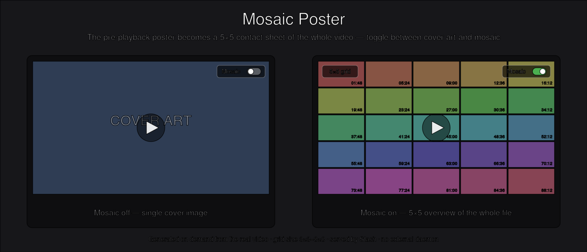

# Mosaic Poster

A Stash UI plugin that replaces the pre-playback **poster** on the scene detail
page (`/scenes/{id}`) with a **contact sheet** — a whole-video overview sampled
evenly across the file. A button at the top-right of the poster toggles
**cover art ⇄ mosaic**, and a button at the top-left cycles the **grid size**
(3×3 up to 8×8). List and card cover art is left untouched.

Whether the mosaic shows by default, and the grid size, are **global plugin
settings** (shared across devices). The cover/mosaic button overrides the
default **for that scene only** (remembered per scene in the browser); the grid
button changes the global size.

## Why

The default poster is a single cover image. For a lot of libraries you want to
see *what is actually in the file* before playing it. Mosaic Poster gives you a
25-frame overview generated from the real video, on demand, without changing any
core Stash behaviour.

## How it works

The plugin is self-contained — a single Stash plugin that is both a UI plugin
and a Python-backed plugin. **No standalone daemon, no fixed port, no
OS-specific service.**

| Part | File | Role |
|---|---|---|
| Frontend | `MosaicPoster.{js,css}` | Overlays the sheet on the detail poster and provides the toggle. Pre-warms sheets for cards near the viewport. |
| Backend | `MosaicPoster.py` | Invoked via `runPluginOperation`. Generates the 5×5 sheet from the real video with ffmpeg. |

Flow:

1. The frontend asks the backend to generate a sheet for a scene at the current
   grid size (`runPluginOperation`, `mode: generate`, `n: <grid>`).
2. The backend reads ffmpeg/ffprobe and the generated-files path **from Stash's
   own configuration** (so it works on any OS), samples N×N frames with input
   seeking, tiles them into a 16:9 JPEG (5×5 = 1920×1080), and writes it to
   `generated/<oshash>_<N>x<N>.jpg` inside the plugin directory.
3. Stash serves that folder statically (via `ui.assets`) at
   `/plugin/MosaicPoster/assets/generated/<oshash>_<N>x<N>.jpg`, so the frontend
   just loads it as a normal, HTTP-cacheable image.

Each grid size is cached independently, so switching sizes is instant once a
size has been generated once. 16:9 cells in a square N×N grid keep the whole
sheet 16:9, matching the poster area.

While a sheet is being generated for the first time (2–3s), a coarse
placeholder built from Stash's existing sprite is shown, then swapped for the
hi-res sheet. If a sheet already exists, the sprite step is skipped entirely so
there is no flicker.

### Viewport-following pre-generation (warm)

When browsing a scene list, the plugin pre-generates sheets for cards that are
visible or about to become visible (about 1.5 screens ahead), using an
`IntersectionObserver`. This means opening a scene's detail page shows the sheet
instantly. Whether the list shows 40 or 1000 items, it only ever generates what
you actually scroll past — never the whole list blindly. Warm requests are
batched and run one at a time (one ffmpeg) to keep the machine responsive.

## Requirements

- Stash **v0.31.0+** (uses `runPluginOperation` and plugin `assets` serving).
- `python` 3 on `PATH` (standard library only — no pip packages).
- ffmpeg/ffprobe. Stash's bundled binaries are used automatically; if you have
  configured custom ffmpeg/ffprobe paths in Stash, those are used instead.

## Install

1. Copy this folder into your Stash `plugins/` directory (or install from a
   plugin source that includes it).
2. Settings → Plugins → **Reload plugins**.
3. Open any scene — the poster now shows the mosaic.

## Settings

- **Show mosaic by default** — when enabled (default), scenes open showing the
  mosaic; disable to open with cover art. This is the global default; the
  cover/mosaic button on a scene's poster overrides it for that scene only.
- **Tap a cell to seek** — when enabled (default), clicking a mosaic cell jumps
  playback to that point in the video; disable to make clicking play from the
  start instead.
- **Mosaic grid size (3-8)** — frames per side (N for an N×N sheet), 3–8,
  default 5. This is the same value as the grid button on the poster; changing
  either one keeps both in sync (reload the scene tab to pick up a change made
  from the Settings page).
- **Cache limit (files)** — maximum number of generated sheets to keep. Excess
  is removed least-recently-viewed first (LRU). ~0.3MB each; default 250 (~75MB).
  0 = unlimited. Generated sheets are disposable: if one is pruned it is simply
  regenerated (a few seconds) the next time that scene is opened.

## Tasks

- **Backfill mosaics** — generate every missing sheet across the whole library
  (mounted files only).
- **Prune mosaic cache** — shrink the cache down to the configured limit.

## Localization

The on-poster button/tooltip strings follow Stash's UI language and ship with
translations for every language Stash supports (English is the default fallback
for any unset locale). Non-English strings are best-effort — corrections from
native speakers are welcome; add or edit an entry in the `STRINGS` table in
`MosaicPoster.js` (keyed by lower-cased language code, e.g. `de` or `zh-tw`).
Plugin **Settings** labels are static and remain in English (a Stash limitation).

## Notes

- Generated sheets live in `generated/` inside the plugin directory and are not
  meant to be committed (see `.gitignore`).
- Core Stash config is never modified.
