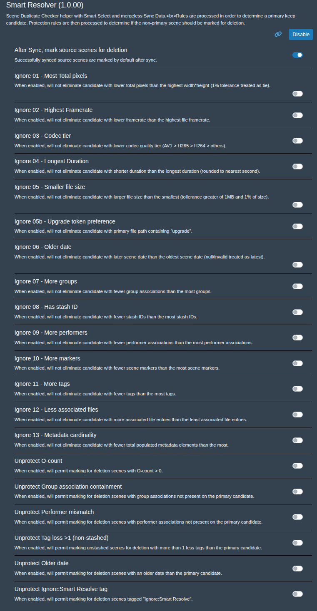

# Smart Resolve

https://discourse.stashapp.cc/t/smart-resolver/6680

UI plugin for Stash’s **Scene Duplicate Checker** (`Settings → Tools → Scene Duplicate Checker`).

## What it does

1. **Smart Resolve analysis/tagging** — Adds `Select Smart Resolve` to Stash’s native **Select Options** menu and annotates duplicate rows with reason text plus sync recommendations.
2. **Row tools** — Adds per-row **Sync data** / **Sync rec.** buttons and stash ID badges in the scene details icon row.
3. **Safe selection** — Auto-selects delete candidates only when rules say it is safe; unresolved/sync-required sets are left unchecked.

## Smart Resolve rule flow

*Goal:* Identify a single candidate keeper regardless of initial candidate scene count. 

Rules run per each duplicate group on the page.

1. **Determine a primary keep candidate**
  - Process each rule in order.  
  - Any scene which is deficient of the identified criteria level is eliminated from being the potential keeper and any remaining tied survivors are evaluated as the next sub-step.
  - When a sub-step leaves only one file as the potential keeper, move to step 2.  
  - For any step where the value is not known or null, assume 0 for this phase
  - Store step result as selection reason.
  - Rules 1-13 are toggleable via plugin settings; rule 14 remains always-on, deterministic fallback.
   1) Prefer the scene with the greatest total pixel resolution (product of x and y, 1920x1080=2073600)
      - Apply a 1% pixel-area tolerance: candidates within 1% of the top area are treated as tied for this step.
   2) Prefer the scene with the greatest framerate
   3) Prefer the scene with the better codec (AV1 > H265 > H264 > Others)
  3b) Prefer candidates whose primary file path includes `upgrade` (toggleable)
   4) Prefer the scene with greater duration
   5) Prefer the scene with smaller size (unless file name includes `upgrade`)
      - Files with the word `upgrade` cannot be eliminated from candidacy as per having a larger file size.
      - Apply file-size tolerance when eliminating larger files: allow `max(1MB, 1% of min file size)` above the smallest file size.
      - In a multi-file scenario, files larger than `min + tolerance` may be eliminated (unless `upgrade` token applies).
   6) Prefer the scene with an older scene date (2 day tollerance)
   7) Prefer the scene with more groups
   8) Prefer the scene with stashID
   9) Prefer the scene with more performers
   10) Prefer the scene with markers
   11) Prefer the scene with more tags
   12) Prefer the scene with LESS associated files
   13) Prefer the scene with more non-null metadata elements (title, studio_code, urls, date, director, galleries, studio, performers, groups, tags, details)
   14) Final deterministic tiebreaker, the scene with a lower scene_id
2. **Evaluate each non-keeper iteratively to prevent data loss**
   Process each scene and each rule to determine status:
   ```
   markForDeletion: (boolean)
   markParentForSync: (boolean)
   exceptions: ([array](string))
   ```
   Exception rules (any of these will trigger markForDeletion=false)
  - Protection rules a-f are toggleable via plugin settings.
   a) Protect O-count: O-count scenes should never be marked for deletion 
   b) Protect Group associations: Only mark for deletion if the same or more group information is attached to the primary candidate (i.e. k.groups{id,index} contains all (n.groups{id,index})
     - null allows a match with only other null
     - null does not match a non-null
     - Scenes may be members of multiple groups.  A primary source (k) must replicate all non-keeper (n) sources to not have an exception
     - Miss-matched scenes should be flagged according to reason message and marked for manual resolution
  c) Protect performer mismatch by ID (markParentForSync=true)
      - If non-keeper has any performer ID not present on keeper, trigger exception
      - Only identical performer ID sets avoid this exception
   d) Protect tag loss >1 for non-stash'd scenes (markParentForSync=true)
   e) Protect older dates 
       if K.date > n.date (markParentForSync=true)
       if K.date == null && n.date != null (markParentForSync=true)
       if K.date != null && n.date == null (no action)
  f) Protect scenes tagged with "Ignore:Smart Resolve" (case-insensitive); never auto-delete these scenes

3. **Generate decision reason (`reasonAgainst`)**
   - Generate message from decision code
   - If exception code array is not empty, expand message. Block marking, recommend sync. 
     - row button becomes **Sync rec.**
     - unresolved count increments
     - smart auto-selection skips that set

Notes:
A primary file is determined, then we determine if non-primary needs to be protected from loss.  The primary file is never changed mid-analysis.  Exceptions do not change the primary file, only protect loss.

## Usage

1. Install the plugin folder under your Stash plugins directory and enable it in **Settings → Plugins**.
2. Open the **Scene Duplicate Checker**.
3. Open **Select Options** and click **Select Smart Resolve**.
4. Review unresolved/sync-rec rows (`Sync rec.` buttons and unresolved counter).
5. Use row **Sync data** where recommended, then re-run Smart Resolve.
6. Use Stash’s native Delete/Merge actions on remaining selected rows.

Optional setting: **After Sync, mark source scenes for deletion** — default for the “check sources after sync” checkbox in the Sync modal.

## Settings UI



## Limits

- Rules evaluate **only visible duplicate groups on the current page**. Pagination and page size can change outcomes seen in a single run.
- Any missing/unknown criterion values are normalized to `0` during candidate selection (line 20 behavior). This preserves determinism but can favor records with more populated metadata fields.
- Step 1 is a strict elimination pipeline. Once a scene is eliminated by an earlier criterion, later criteria do not reintroduce it.
- The `upgrade` filename exception is a string heuristic. It is not case-sensitive. This step is not expected to be a major factor, but creates an easy way to work around the plugin.
- Group protection depends on `{group.id, scene_index}` containment semantics; mismatches are expected to force manual/sync resolution.
- Date protection assumes parseable comparable date values. Stash provides some date parse semantics.  However all null dates should be assumed to be the last date of any incomplete window. (i.e. 2020 -> 2020-12-31, 2020-06 -> 2020-06-30)  Null, Invalid, or unparseable values should be treated as 2999-12-31 by implementation.
- `markParentForSync` and `exceptions` are structured outputs in this spec, but UI sync-rec indicators must be wired to those flags in implementation.
- This flow is designed for deterministic outcomes, not probabilistic ranking; tie-break behavior is intentionally resolved by lower `scene_id`.
- Sync actions are `sceneUpdate`-based (metadata transfer), not full `sceneMerge`; scene IDs remain separate after sync.

## Repository

Maintained in [Stash-KennyG/CommunityScripts](https://github.com/Stash-KennyG/CommunityScripts).
