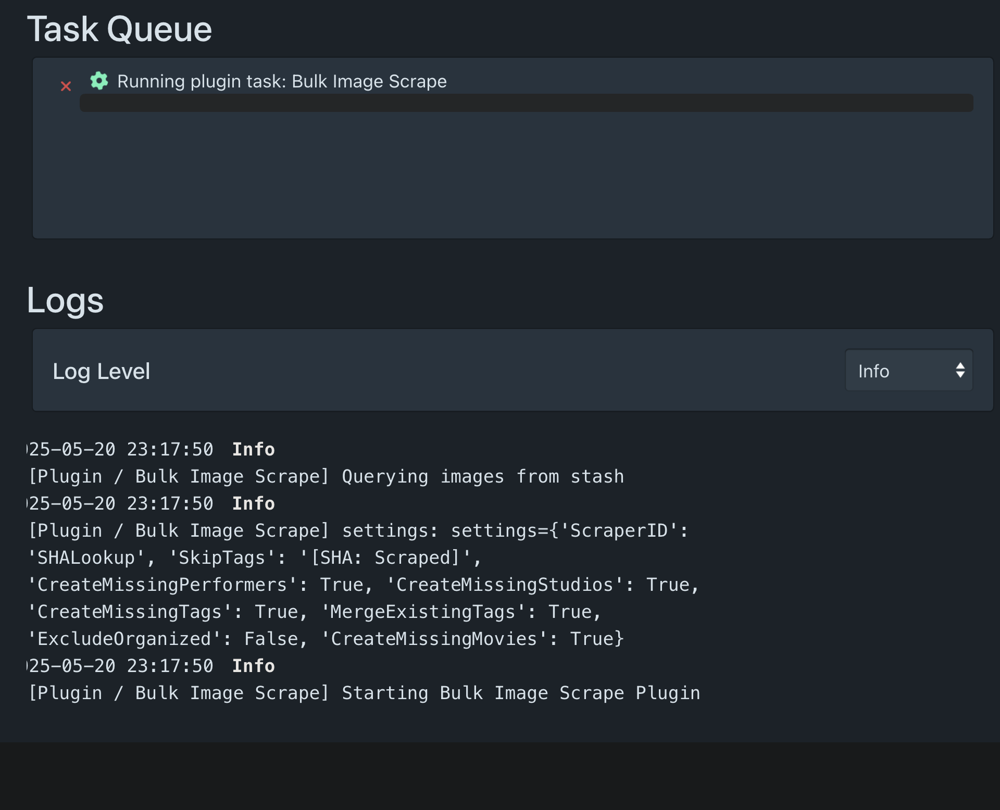

# Bulk Image Scraper

https://discourse.stashapp.cc/t/bulk-image-scrape/1339

Apply any image scraper to all of your images

## Install

The Plugin uses [PythonDepManager](https://github.com/stashapp/CommunityScripts/tree/main/plugins/PythonDepManager) to install requirements on it's own. `git` and `pip` must be installed for everything to work properly

## Config

Go into your Stash then under `Settings > Plugins` you'll find the config for Bulk Image Scrape

It is mandatory to enter the Scraper ID of the Scraper you want to use. In this example [SHALookup](https://github.com/FansDB/metadata-scrapers) is used but you can use any [valid Image Scraper](#scraper-requirements) that is installed in your Stash.

- `Create Missing movies/groups from scrape result`

> If the scraper returns a movie/group and it is not already in your stash, the plugin will create it if enabled

- `Create Missing performer from scrape result`

> If the scraper returns a performer and it is not already in your stash, the plugin will create it if enabled

- `Create Missing studios from scrape result`

> If the scraper returns a studio and it is not already in your stash, the plugin will create it if enabled

- `Exclude images that are set as organized`

> Any image that is set as organized will be skipped if enabled

- `Merge existingtags with scraped tags`

> Merge scraped tags with existing tags instead of overwriting them when enabled

- `The Scraper ID of the image scraper to use`

> Enter the ID of the scraper you want to use. If this is not set correctly the plugin will tell you in the logs when you run the plugin task

- `List of tags to skip`

> Any image that has one or more of the Tags from this setting will be skipped by the plugin if Tags are specified here. Multiple Tags must be comma separated. If the plugin can't find a tag you specified it will notify you in the logs

## Task

After you adapted the config to your liking and made sure your image scraper of choice works properly simply start the task in `Settings > Tasks`

Once the Task is running you can track the progress in `Settings > Log`
If the plugin encounters any issues you will be informed here

## Scraper Requirements

### Scraper ID

You must set the Scraper ID which you can find in `Settings > Metadata Providers > Installed Scrapers`

The Scraper ID is shown below the Scraper name and is highlighted in red here:

### Valid Image Scraper

The scraper you choose must be listed as an image scraper in `Settings > Metadata Providers > Scrapers > Image scrapers`

