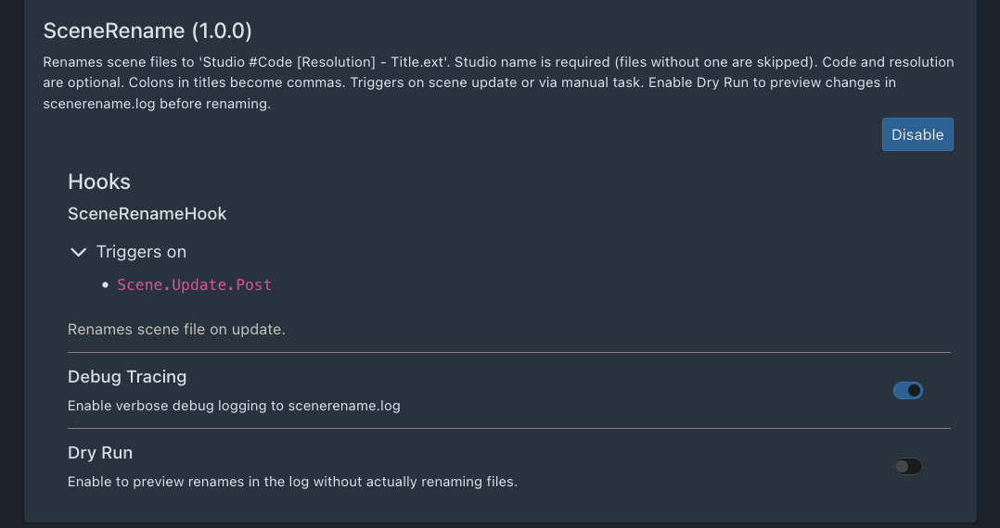

# Scene Rename: File Organizer Plugin

Simple plugin to help organize scene files into a clean, consistent format. It includes debug tracing that integrates with the `Logs` view, supports dry runs, and provides a clear description in the Plugins UI.


## Features

* Dry run support
* Debug output in the `Logs` view
* Graceful handling of already-renamed files
* Does not fail if Scene ID or resolution are missing
* Requires a Studio and Title to proceed

The code is simple and the plugin UI includes clear usage instructions.


## Screenshot



---

## What It Does

The `Scene Rename` plugin renames scene files using the following format:

```
Studio #StudioID [Resolution] - Title.mp4
```

For example, a file in my library that still has its default name:

```
wodhhd_06_1080p.mp4
```

Is renamed to:

```
TitanMen #395 [1080p] - Coyote Point, Dakota Rivers.mp4
```

This format keeps filenames consistent and easy to scan. It also makes it simple to group files by studio if desired, or keep everything in a single directory while maintaining a clean, uniform structure.

I’ve found it very effective for keeping my library organized, and others may find it useful as well.

---

## Installation Example (Docker)

I run Stash in Docker. My folder structure looks like this:

```
docker/
└── docker-compose.yml
└── plugins/
    └── scenerename/
        ├── scenerename.py
        └── scenerename.yml
```

In `docker-compose.yml`, add the following under `volumes`:

```
- ./plugins/scenerename:/root/.stash/plugins/scenerename
```

That’s all that’s required. The plugin loads normally, outputs to the Logs window, and supports dry runs.